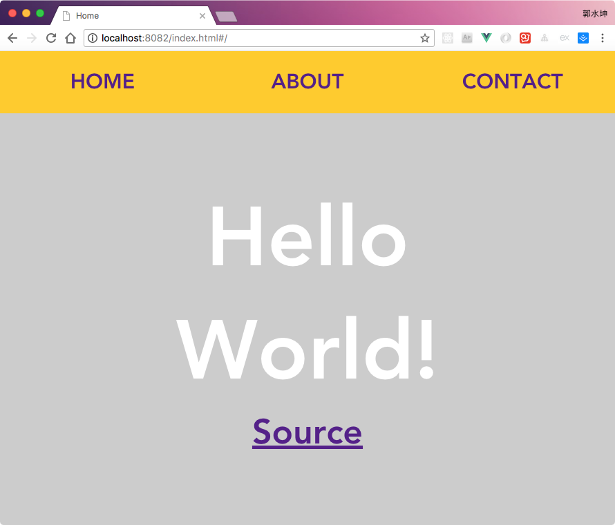

# webpack-multiple-pages

配置多入口和多出口，每个入口都可以是一个完整的Vue项目。Vue(2.5.2)  Webpack(3.6.0)。



## Build Setup

``` bash
# install dependencies
npm install

# serve with hot reload at localhost:8080
npm run dev

# build for production with minification
npm run build

# build for production and view the bundle analyzer report
npm run build --report
```

For a detailed explanation on how things work, check out the [guide](http://vuejs-templates.github.io/webpack/) and [docs for vue-loader](http://vuejs.github.io/vue-loader).

参考链接：[使用Vue-cli搭建多页面应用时对项目结构和配置的调整](https://www.jianshu.com/p/0a30aca71b16) (有部分调整)
